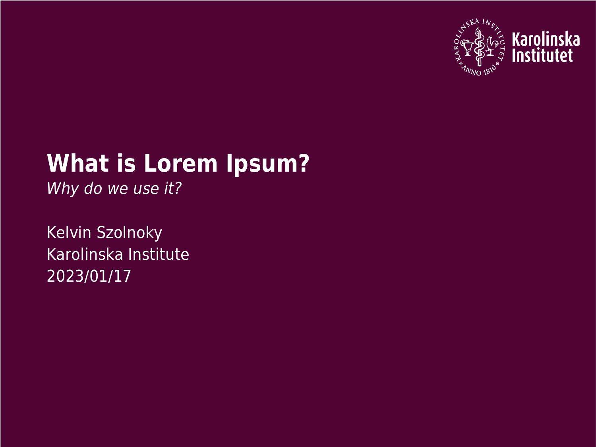

# KI Beamer Theme
Beamer theme for Karolinska Institutets (KI) ~~new~~ graphical design. Complies with Karolinska Institutets new branding from 20/10/2022.

Inspired by [KI Beamer Template](https://github.com/ellessenne/KI-beamer-template).

## Installation and Usage
Works with a standard LaTeX (pdfTeX) installation. Copy `beamerthemeKI.sty` and `ki-logo-white.pdf` to the root of your Beamer project directory. Ensure that the file names are the same. To use add `\usetheme{KI}` to your beamer project file, such as:

```latex
\documentclass{beamer}

\usetheme{KI}
```

For the usage of KI's colour palette see [https://staff.ki.se/kis-colour-palette](https://staff.ki.se/kis-colour-palette) or the official PowerPoint template.

## Example
See `example.tex` and `example.pdf`.



## Known bugs
**Warning**: Using more than one footnote and a page will lead to overlapping with the footline.

In the official Karolinska Institute PowerPoint template the font is [DM Sans](https://fonts.google.com/specimen/DM+Sans) (not packaged on CTAN). For the sake of simplicity a similar Sans Serif font on CTAN was found and used.

## Customisation
Thanks to Beamers implementation it is possible to override all theming. See [Beamers documentation](https://tug.ctan.org/macros/latex/contrib/beamer/doc/beameruserguide.pdf) for more information and guides.

## License and Copyright
All code is licensed under [MIT](https://opensource.org/licenses/MIT). See the `LICENSE` file.

All rights related to the logo are property of Karolinska Institutet. For more information visit [https://staff.ki.se/brand-use-legal-support](https://staff.ki.se/brand-use-legal-support).